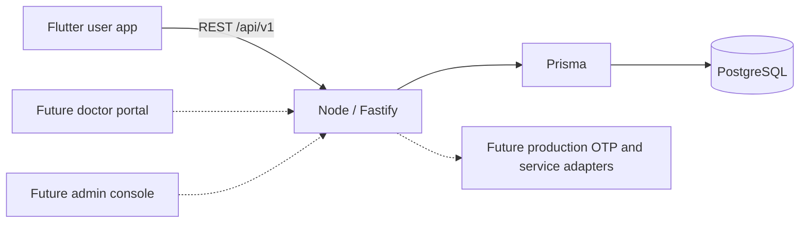

# Pocket Doctor architecture — through Phase 7

## Phase 7 operations and release boundaries

The new admin console joins Flutter and the doctor portal on the same Fastify
`/api/v1` boundary. Identity and the shared EnrollmentPayment ledger remain
authoritative. A global administrative gate adds ADMIN authorization, durable
TOTP step-up and minimal append-only audit evidence across old and new routes.
Account status is checked on every session validation. Persistent per-account
action budgets complement existing IP/OTP/AI protections.

Privacy APIs expose versioned, separate consent choices, owner-scoped paginated
exports and an access-deletion request that preserves records for approved
retention review. Flutter adds a privacy repository, Riverpod providers/actions
and protected Settings routes through the existing centralized HTTP client.

The Notification inbox/outbox references existing domain events with unique
source keys. A separate worker collects updates and leases bounded external
delivery attempts. Provider adapters never turn an uncertain send or client
payment callback into a confirmed result. Signed Razorpay events enter a durable
reconciliation inbox; actual live checkout/recurring fulfillment is still blocked.

Database additions are additive. Runtime grants are separated from schema-owner
access, backups have an isolated restore procedure, and deployments separate API,
worker, database and static clients. See [Phase 7](phase-7.md),
[security audit](phase-7-security-audit.md) and [production runbook](production-runbook.md)
for the exact controls, limitations and rollout/rollback responsibilities.

## Phase 6 membership and revenue extension

The existing User and EnrollmentPayment models remain authoritative. Membership
adds configurable plans/benefits, subscription snapshots, lifecycle events,
coupons/reservations and receipts. A partial PostgreSQL unique index prevents
duplicate open memberships, while transaction locks serialize coupon and
subscription mutations. Verified payments create one receipt atomically across
all four revenue sources. Demo and real reporting remain separate.

`membership/entitlements.ts` checks provider, status, period/grace dates and
resource allowlists. Programs, consultations, wellness checkout and assistant
facts/quotas call this common boundary. Flutter Riverpod state renders backend
plans and access decisions through the existing API client and protected
GoRouter routes. Cancellation retains access through the paid period; manual
renewal does not claim a recurring provider mandate. Existing notifications
display membership lifecycle events without adding an external delivery system.

See [Phase 6](phase-6.md) for API tables, data relationships, lifecycle rules,
security boundaries and production dependencies. Provider-confirmed recurring
billing, tax/legal configuration and the full admin experience remain future
work at the end of Phase 6; Phase 7 status is documented above.

## Phase 5 assistant extension

The current system includes the Flutter app, the existing doctor portal and the
modular Fastify API. The assistant extends this API and PostgreSQL database;
it does not replace any Phase 0–4 subsystem. The older sections below describe
the architecture as it evolved.

Authenticated requests pass through consent, ownership, quotas, safety routing,
bounded provider intent selection, authorized context queries and reviewed
response rendering. The model has no privileged tools and cannot generate
executable actions. Account facts stay on the backend; only bounded conversation
input reaches an enabled provider. Personal records have owner foreign keys and
explicit deletion controls. Riverpod state depends on the signed-in identity;
GoRouter protects all new routes. The existing HTTP client and session handling
are reused.

WhatsApp uses verified raw webhooks, expiring hashed linking codes, app-side
confirmation and unique identities. The same safety and ownership boundaries
apply. The outbound adapter remains unconfigured. Reminder events reuse the
consultation outbox and add explicit user-created reminders; no duplicate push
infrastructure is introduced.

See [Phase 5 architecture, APIs and boundaries](phase-5.md) for the current
implementation, and [security review](phase-5-review.md) for its practical limits.

## System boundaries (original foundation)



Phase 0 architecture is preserved: a modular REST backend, one PostgreSQL database,
feature-oriented Flutter, Riverpod, go_router and package:http. Doctor/admin web
directories remain documentation-only. They will use the same API and must not
access the database from browser code. No Next.js framework or microservice was
introduced unnecessarily.

## Identity and sessions

`OtpChallenge` holds one latest challenge per normalized phone number. A random
six-digit code is HMAC-SHA256 hashed using a private environment secret plus the
challenge ID. The database stores expiry, attempts, consumed state, requested time,
hourly window and request count. A PostgreSQL advisory lock serializes phone requests;
row locks serialize verification. Wrong attempts commit even when verification fails.
A successful verification consumes the challenge and creates/restores a user and
session in one transaction. Concurrent verification can create only one session.

Phase 1 supports India (+91 and a validated ten-digit mobile number). Client country
normalization and API validation are centralized and can be extended together.
New users receive USER only. Roles are never accepted from profile input. Nullable
phone fields preserve compatibility with the Phase 0 schema; public auth creates
phone-linked users. One identity may have multiple server-assigned roles.

Sessions use random 256-bit opaque bearer tokens. Only SHA-256 token hashes persist
on the server. Every authenticated API call checks the session record and its fixed
seven-day expiry. Logout deletes that session. There is no JWT decoder, refresh-token
rotation or silent sliding expiration; after expiry the user signs in again. A future
JWT implementation must add signature/issuer/audience checks to the verifier contract.

Development OTP is deliberately enabled with OTP_MODE=development plus a random
SESSION_SECRET. It returns a random code in the local API response without sending
SMS. The server binds this mode to loopback and forbids it in staging/production.
This demonstrates the entire flow without pretending to verify phone ownership by SMS.
Production delivery is intentionally unavailable until a provider is implemented.

## Flutter state and storage

`authProvider` owns authentication phase, current user, pending OTP challenge, loading
and safe error states. `currentUserProvider` derives the user; no duplicate mutable
profile/home copies exist. Repository and client providers support test overrides.
Feature-only category filters and onboarding page index use widget state; all
authentication/profile/API state uses Riverpod.

```text
features/auth/
  domain/       AuthState, OtpChallenge, SessionRepository and phone validation
  data/         API session repository
  application/  AuthController
  presentation/ Splash, onboarding, login and OTP
features/profile/
  domain/       UserProfile, ProfileDraft and allowed interests/languages
  presentation/ Profile setup/edit and account overview
core/networking/ ApiClient plus retained Phase 0 health repository
core/storage/    SessionStore platform boundary
```

Mobile tokens use flutter_secure_storage (Android Keystore-backed encryption / iOS
Keychain). Android backup is disabled and iOS Keychain entitlements are configured.
No token or health information is written to plain shared preferences. Onboarding
completion and a sign-out marker are non-sensitive preferences. The marker prevents
automatic restoration after a local sign-out even if secure deletion encounters an
OS error. Browser validation stores tokens in memory, never localStorage.

The API client owns the in-memory credential and sends it only on authenticated
requests. Central 401 handling clears user/OTP/session state and updates route guards.
Generation counters reject late responses after logout/account changes. Startup
network failures retain the secure token behind a retry screen instead of pretending
the user is signed out. Resume triggers session revalidation. Offline logout clears
local state and honestly reports that server revocation could not be confirmed.

## Routing and user journey

A stable GoRouter instance listens to Riverpod through a small refresh notifier.
The notifier is a router adapter, not a second application state framework.

```text
initializing / retry → /splash
new signed-out user → /welcome (three pages maximum)
returning signed-out user → /login
pending code → /otp
verified identity, incomplete profile → /profile/setup
complete authenticated profile → /home
```

Authenticated screens: /home, /programs, /consult, /assistant, /profile,
/profile/edit, /health, /shop, /settings, /notifications and /settings/{privacy,terms,help}.
The Phase 0 /consultation path redirects to /consult. The five bottom tabs retain
independent navigation branches using StatefulShellRoute.indexedStack. Logout removes
the authenticated branch tree. Direct links cannot bypass profile setup or sign-in.

Reserved future patterns stay documented in app_routes.dart:
/doctors, /doctors/:id, /consultation/:id, /products/:id, /cart, /orders,
/membership and additional personal-activity areas. /shop is a real Phase 1 landing
screen, not a checkout route. Unavailable paths show a recoverable error page.
OS universal-link association files are not part of Phase 1.

## API communication and backend

The central client maps success envelopes to typed models and maps errors to safe
user-facing messages. Widgets never make raw HTTP calls. Timeouts, missing sessions,
HTTP errors and malformed responses have explicit handling; mutation requests are
not automatically retried. Profile edits remain on screen after failures and can
be retried without losing typed input.

Fastify app construction remains separate from socket startup. Environment validation,
bounded Prisma pooling, request IDs, privacy-conscious logs, Helmet and exact CORS
origins remain in place. Auth adds route-specific IP rate limits and persistent
phone limits. JSON Schema validates OTP requests; strict Zod validation permits only
name, language, interests and notification preference in profile updates. Self-profile
operations derive user ID from the authenticated principal, never request input.

The identity models remain intact. Phase 2 adds Doctor, ProgramCategory, Program,
ProgramModule, Lesson, ProgramEnrollment, LessonProgress, LiveSession and
EnrollmentPayment through an additive migration. Optional wellness interests are
preferences, not diagnoses. No medical history or clinical interpretation is modelled.

## Program architecture

ProgramRepository uses the existing authenticated HTTP client. Riverpod separates
discovery filters, categories, detail, My Programs, overview, lesson and mutation
states. GoRouter protects `/programs/:id`, `/my-programs`, `/my-programs/:id` and
`/my-programs/:id/lessons/:lessonId` using the existing authentication guard.
Repository providers depend on the signed-in user, invalidating cached program
state when identity changes. Mutations refresh the affected learning views.

The backend derives user identity from the session, validates strict inputs, and
checks published visibility and enrollment/payment before protected lessons or
progress. Discovery/detail DTOs omit media references and lesson materials.
Payments are separate persisted orders with server-owned amounts and currencies.
Only a verified provider receipt can atomically create a paid entitlement. The
available provider is an explicitly local, demo-only simulator; real Razorpay is
disabled. No client-supplied paid flag is accepted.

PostgreSQL uniqueness and transaction locks serialize duplicate enrollment,
payment settlement and progress completion. Lesson completion is self-reported,
not proof of watch time or a medical outcome. All required lessons determine the
program completion state. Live schedules are separate from consultation services;
live joining remains provider-ready and unavailable in this phase.

See [Phase 2](phase-2.md) for the data model, endpoint contract, media boundary,
analytics scope, testing and publishing limitations.

## Phase 3 consultation architecture

The existing Doctor links to User and gains controlled verification, languages,
fee and scheduling configuration. The existing payment ledger supports one program
or consultation target through a database constraint; no duplicate payment/user
system exists. Consultation owns UTC timestamps, fee snapshots, status, hold expiry,
notes and reminder outbox rows. Disjoint local weekly windows and exception dates
generate slots on the server. Doctor-row transactions and a PostgreSQL range
exclusion constraint prevent both exact and overlapping bookings.

Patient APIs enforce own-user access; doctor APIs require DOCTOR role plus a linked
verified profile and assignment. Private notes never enter patient DTOs. Client
payment status is not authority: server receipt verification and confirmation
commit atomically. Rescheduling preserves the old time when the replacement fails.
Cancellation policy is configured on the server and refunds remain honest review
states. No provider connection or real charge is presented as operational.

Flutter extends the consultation feature using the existing package:http client,
Riverpod providers and GoRouter auth guards. The five bottom tabs remain unchanged.
The separate minimum doctor portal is a small Vite/TypeScript web app; it shares
identity and domain APIs, stores browser sessions only in memory and clears private
state on unauthorized responses. It does not connect directly to PostgreSQL.

See [Phase 3 architecture and contracts](phase-3.md) for verification operations,
state transitions, content privacy, provider boundaries and validation commands.

## Phase 4 wellness commerce

`WellnessProduct` and data-driven `WellnessCategory` add a business-controlled,
reviewed unrestricted catalogue. CartItem persists absolute quantities per user;
Address is owner-scoped. Order and OrderItem preserve authoritative monetary,
product, returns-policy and shipping-address snapshots. The existing EnrollmentPayment
ledger gains an optional order target; SQL requires exactly one program,
consultation or commerce target. There is no second identity or payment system.

The commerce service serializes stock/order/admin mutations using one PostgreSQL
transaction advisory lock for the small curated catalogue. Reservation, verified
sale, expiry and cancellation change inventory and order state atomically. Stock
checks and non-negative SQL constraints provide independent safeguards. Checkout
compares a server-generated quote digest and reuses idempotent orders. Provider
receipts, never client totals or success flags, authorize settlement.

Flutter's `features/wellness` contains typed models, the existing ApiClient-backed
repository, Riverpod providers/actions and separate catalogue/detail/cart/address/
checkout/order screens. Routes inherit central authentication protection. No new
bottom tab is added. Customer data providers depend on the active identity.

Minimal ADMIN APIs manage catalogue, inventory and fulfilment without an admin UI.
Shipping is an adapter boundary with an explicit local demo quote. Refund requests
are recorded without implying repayment. See [Phase 4](phase-4.md) for operations,
API routes, security boundaries and production dependencies.

## Future boundaries

Programs support the learning lifecycle; consultations support reservations and
records with a provider-ready connection; wellness supports explicit local demo
commerce; assistant suggestions open explanatory future
states, not model-generated answers. My Health displays real saved interests and
honest empty activity states. Notification switches store a preference; no push is
sent and no fabricated notification feed exists.

Secure video hosting, production Razorpay, AI, WhatsApp and push remain adapter boundaries.
Phase 5+ must introduce reviewed domain models, resource authorization and migrations
when requirements are approved. Formal consent, retention, export/deletion, audit
storage and legal terms must precede public health-data use. No compliance is claimed.

Reference patterns: [Prisma transactions](https://docs.prisma.io/docs/orm/v7/prisma-client/queries/transactions),
[Node crypto](https://nodejs.org/api/crypto.html), and
[Flutter secure storage](https://pub.dev/packages/flutter_secure_storage).
