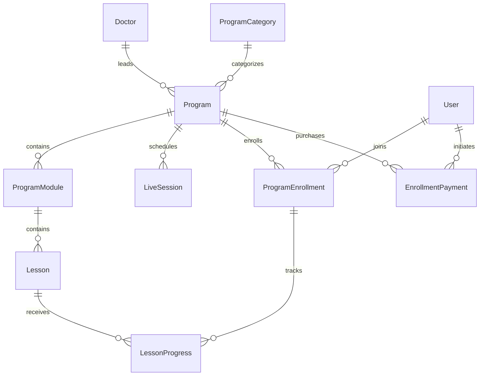

# Phase 2 — Learn & Transform

Pocket Doctor offers structured health education: learn, follow, act, track and
build sustainable habits. Programs do not promise cures, guaranteed weight loss,
diabetes remission or any clinical outcome. Only demo content is supplied here;
real programs require reviewed content and verified professionals before publishing.

## User journey and screens

Home retains the four core services and adds a compact Continue Learning area,
interest-based recommendations, featured learning and live learning entry points.
Programs provides Explore and My Programs. Explore includes submitted search,
category/type/free-paid/short-duration filters and paginated results. Recommendations
are optional. The two flagship category choices appear first; additional topics and
format/price/preferences expand on demand to keep programs easy to reach. Recommendations
match selected interests and exclude already-enrolled programs; they are not medical
recommendations. Empty interests produce an honest empty recommendation state.

Program cards show a cover (or deliberate branded placeholder), title, professional,
format, duration, lesson/session count, price and enrollment/progress. Details show
audience, learning outcomes, modules/lesson titles, professional information, schedule,
educational scope and enrollment CTA. My Programs separates active/completed entries.
Overview shows required-lesson progress, resume, module navigation and completion date.
The lesson screen supports reading material, video play/pause/seeking, saved position,
key points, completion, next lesson and returning to the overview.

API-driven views expose loading, empty, safe error and retry states. Failed progress
saves retain the current lesson/player position and provide retry or an explicit
leave-without-saving action. Position checkpoints occur on playback transitions,
every 15 seconds during playback, lifecycle pause and explicit save/back. Full offline
downloads are not implemented. Force-closing the app may lose the latest unsaved
checkpoint; server-confirmed progress is durable.

## Data model



Existing User/UserRole/OTP/Session records are preserved. UUIDs, foreign keys,
unique module/lesson positions and unique user-program enrollment prevent duplicate
relationships. Required-lesson completion determines percentage and completion;
optional lessons do not block completion. Completion dates are retained on repeated
updates. Progress cannot mark lessons from another program. Catalog visibility
requires published content and a verified non-demo professional, or explicit local
demo visibility. Provider media references remain separate from public lesson metadata.

Free enrollment is transactional and idempotent. Paid enrollment is created only
with provider-verified payment. Statuses are ENROLLED, IN_PROGRESS and COMPLETED.
Publishing tools must treat enrolled curriculum as versioned/immutable: arbitrary
edits to required lessons would change completion semantics. A full curriculum
versioning/publishing workflow is not provided in this controlled-seed phase.

## APIs

All endpoints require an existing bearer session. IDs use UUID validation; user IDs
are taken only from the authenticated principal. Success uses the existing `data`
envelope; error details and secrets are not returned.

| Method | Path under `/api/v1` | Purpose |
| --- | --- | --- |
| GET | `/programs` | Search and filters; 20/page, bounded page number |
| GET | `/programs/categories` | Ordered data-driven categories |
| GET | `/programs/featured` | Featured discovery |
| GET | `/programs/:id` | Safe detail and enrollment state |
| POST | `/programs/:id/enroll` | Idempotent free enrollment; empty body |
| POST | `/programs/:id/payment` | Server-priced development payment order; empty body |
| POST | `/program-payments/:id/development-settle` | Local simulator only; `{outcome: "capture" or "fail"}` |
| GET | `/me/programs` | Up to 100 own enrollments and progress summaries |
| GET | `/me/programs/:id` | Entitlement-checked overview |
| GET | `/me/programs/:id/progress` | Persisted progress summary |
| GET | `/me/programs/:id/lessons/:lessonId` | Protected lesson/materials/media resolution |
| POST | `/me/programs/:id/lessons/:lessonId/progress` | `{positionSeconds: integer, completed: boolean}` |

Discovery accepts `q` (max 100 chars), `category`, `type=RECORDED|LIVE`,
`price=free|paid`, `duration=short|long` (60-minute boundary),
`recommended=true|false` and `page`. Search covers title, description,
professional name and category. Unknown query/body fields are rejected.

## Payments and access control

`PAYMENT_MODE=disabled` is the default. Production checkout is unavailable until
Razorpay is integrated. A future adapter must create server orders, verify the
checkout signature, fetch provider capture status, and match order, amount, currency
and ownership before enrollment. Webhook reconciliation and refund/revocation policy
must accompany real-money operation. Discounts, coupons and membership pricing are
future pricing-policy inputs, not client overrides; none are implemented now.

`PAYMENT_MODE=development` plus `DEMO_PROGRAMS=true` enables a clearly labelled
simulator for demo programs only. The persisted order determines the amount. The
simulator produces a receipt which is verified before a transaction records VERIFIED
and creates enrollment. Failure creates no entitlement; repeated successful settlement
is idempotent. Client-supplied success/amount/user fields are rejected. This does not
charge money or prove a real payment. The flags are rejected in staging/production,
and the local server binds to loopback. Card details are never collected.

Protected overview, lessons and progress require the user's own enrollment plus
a verified payment for paid programs. Unenrolled detail views contain module/lesson
titles only; they contain neither protected materials nor media references. Never
store private origin URLs in public cover fields. The only supplied video is a public
Flutter demonstration nature clip, explicitly labelled as playback testing, not health
education. Unknown private media references fail closed. Secure hosting must later
resolve opaque references to short-lived, scoped playback URLs after entitlement
checks; DRM, signed hosting and downloads are not implemented.

## Live programs

LiveSession stores schedule, duration, title, member information and an opaque future
provider reference. UPCOMING/LIVE/COMPLETED is derived from the schedule at request time.
No provider reference/join secret is included in DTOs, and joinAvailable is false.
The user can enroll and view information, but no actual live call is available.
Attendance tracking and live-program completion require future provider signals;
passing the scheduled end time does not fabricate attendance or award completion.
This boundary is independent of Phase 3 one-to-one consultations.

## Flutter and Riverpod

`features/programs/domain` holds typed DTO models, `data` owns the repository,
`application` holds providers and enrollment/payment mutations, and `presentation`
holds screens and reusable components. The player progress controller is colocated
with the lesson screen and uses the same repository. No widget performs raw HTTP.

Providers: programRepository, programFilters, programDiscovery, programCategories,
programDetail, myPrograms, programOverview, programLesson, programActions,
lessonProgress, recommendedPrograms and homePrograms. User changes reset the repository
dependency and cached API views. Mutations invalidate relevant detail/overview/lists.
UI-only tab/search-field state stays within widgets; persistent learning state is
owned by the backend. Existing Riverpod/GoRouter/package:http architecture is retained.

## Local setup and tests

Use the existing README setup and a separate local database. Configure:

```dotenv
APP_ENV=development
OTP_MODE=development
DEMO_PROGRAMS=true
PAYMENT_MODE=development
# Set DATABASE_URL and a randomly generated SESSION_SECRET privately.
```

```sh
cd services/api
npm run build
npm run db:deploy
npm run programs:seed
npm start
```

The seed is idempotent and refuses non-demo environments. It does not overwrite
existing programs/progress on rerun. Categories support the two flagship niches and
the additional requested wellness topics; only three demo programs are inserted.
The live demo date is relative to first seeding, not a promise of a real event.

```sh
# backend, with DATABASE_URL and AUTH_INTEGRATION=true for all integration tests
npm run typecheck
npm run db:validate
npm test

# apps/mobile, with the isolated demo API running
flutter analyze
flutter test --concurrency=1 --dart-define=RUN_API_SMOKE=true --dart-define=RUN_AUTH_SMOKE=true --dart-define=RUN_PROGRAM_SMOKE=true
flutter build apk --debug --dart-define=SHOW_DEVELOPMENT_OTP=true --dart-define=API_BASE_URL=http://10.0.2.2:3000/api/v1
flutter build web --debug --dart-define=SHOW_DEVELOPMENT_OTP=true
```

The demo API serves only loopback. Android emulator development uses 10.0.2.2.
Run browser validation on an exact configured CORS origin. Physical-device access
must not be enabled by exposing the unsafe development OTP/payment endpoints publicly.

## Analytics and privacy

Only process-local aggregate counters track viewed/enrolled/started/completed/search
event types. No user IDs, program IDs, search strings, selected interests, or health
data are logged to analytics. Counters reset on restart and are not a billing ledger.
No analytics dashboard or external telemetry service is introduced.

## Known limitations and phase boundaries

- Production SMS, approved logo, release signing, deployment and physical/iOS device
  validation remain outstanding from Phase 1.
- Real Razorpay, reconciliation/refunds, secure media hosting and reviewed medical
  content must precede real sales. App-store distribution/payment eligibility requires
  launch review; the development simulator is not a release payment implementation.
- Only demo professional profiles/content are supplied. No clinical outcome, medical
  advice, certificate or doctor credential is fabricated.
- Live joining, attendance and completion are provider-ready only.
- My Programs is bounded to 100 enrollments; a larger catalog/user library requires
  pagination extensions. Discovery is paginated. No offline video downloads.
- Privacy/deletion/export/retention operations remain launch work; financial history
  has restrictive foreign keys pending an explicit retention policy.
- No doctor/admin authoring portal, consultations, medicine commerce, AI/WhatsApp,
  membership or Phase 3+ functionality is implemented.

Sources for future adapters: [Razorpay checkout verification](https://razorpay.com/docs/payments/payment-gateway/web-integration/standard/integration-steps/)
and [Flutter video player](https://pub.dev/packages/video_player).
See [validation](phase-2-validation.md) for actual checks and platform limitations.
